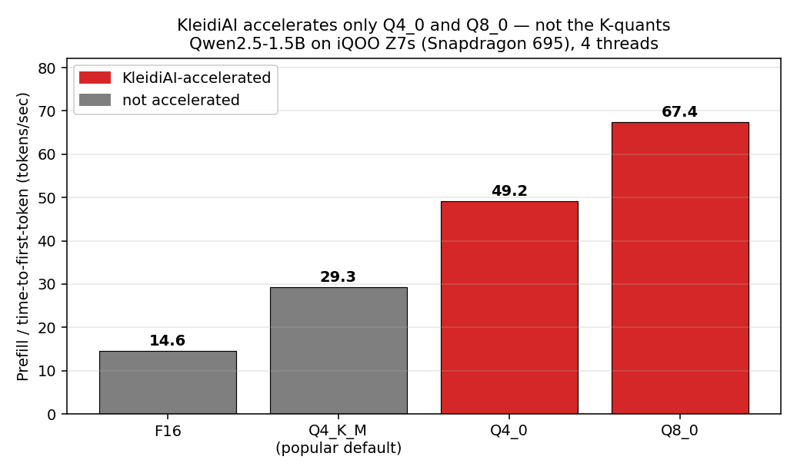
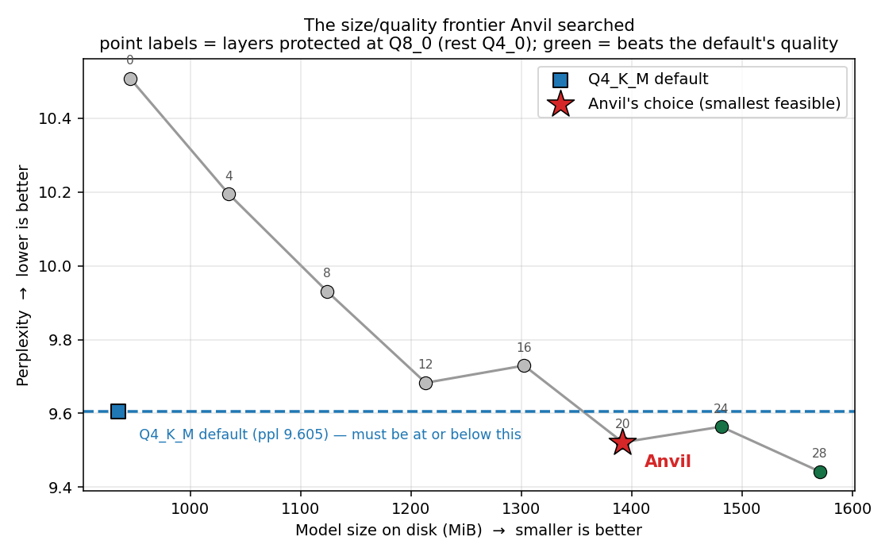
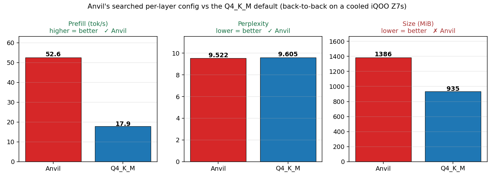

# Anvil — finding the quality/latency boundary for mobile LLM quantization

**20 on-device measurements show why tensor-level protection cannot reproduce
`Q4_K_M` quality on an Arm CPU — and quantify what the missing accelerated
kernel is worth.**

**Arm Create: AI Optimization Challenge 2026 · Mobile AI track**
Measured end-to-end on an **iQOO Z7s (Snapdragon 695)** — a ₹18k mid-range phone,
not a flagship — with **Qwen2.5-1.5B-Instruct** on llama.cpp + KleidiAI.

> **Scope of claims.** All results come from **one model, one device, one
> runtime** (Qwen2.5-1.5B / Snapdragon 695 / llama.cpp b10354). We claim: *for the
> tested Arm mobile configuration, KleidiAI accelerates `Q4_0`/`Q8_0` but not
> `Q4_K_M`, and a 20-measurement search shows `Q4_0`/`Q8_0` tensor selection
> cannot reproduce `Q4_K_M`'s quality at comparable model size.* We do **not**
> claim this generalises to every Arm device or model.

Most on-device optimization is one-size-fits-all: pick `Q4_K_M`, ship it, hope.
Anvil treats it as a **sequential decision problem** — it chooses a quantization
type *per layer*, measures the result on the actual device, calibrates its cost
model, and converges on a configuration tuned to that phone. And it explains
every move.

## The finding that drives everything

While profiling on the Z7s, llama.cpp printed this:

```
kleidiai: no kernel for tensor type q4_K, not accelerated by KleidiAI
          (kernels available for Q4_0 and Q8_0)
```

**KleidiAI — Arm's optimized kernel library — accelerates only `Q4_0` and `Q8_0`.
It does not accelerate the K-quants.** Which means the single most widely shipped
mobile quantization, `Q4_K_M`, misses Arm's fast path entirely:



| Quantization | Prefill (TTFT) | Size | KleidiAI |
|---|---|---|---|
| F16 | 14.6 t/s | 2945 MiB | — |
| **Q4_K_M** (the popular default) | 29.3 t/s | 935 MiB | ❌ |
| Q4_0 | 49.2 t/s | 886 MiB | ✅ |
| Q8_0 | 67.4 t/s | 1565 MiB | ✅ |

`Q4_0` is *both smaller and 1.7× faster* than `Q4_K_M`. The catch is quality:
uniform `Q4_0` degrades perplexity more than `Q4_K_M` does. So the real question
becomes a search problem — **which layers can afford `Q4_0`, and which must stay
at `Q8_0`?** That is exactly what Anvil is for.

## What Anvil found

Anvil searched the per-layer space (`{Q4_0, Q8_0}` over 28 layers = **2.7×10⁸
configurations**, every one of them on KleidiAI's fast path), minimizing model
size subject to *beating the `Q4_K_M` default's quality*. On a budget of **14
on-device evaluations per method**:

| Method | Feasible config found? | Result |
|---|---|---|
| **Anvil** | **yes** | ppl 9.522, 1386 MiB — layers 10–17 → Q4_0, rest → Q8_0 |
| greedy | no | exhausted its budget without reaching feasibility |
| random | no | exhausted its budget without reaching feasibility |

**Anvil found a feasible configuration; greedy and random found none.** That is
the core claim, on real hardware: strategic search reaches a feasible region that
uninformed search does not, within the same measurement budget.

The configuration it chose is also *interpretable* — it protected the outer
layers and quantized the middle 8 (layers 10–17), independently rediscovering the
known result that early and late transformer layers are the quality-critical
ones. It was not told this; it inferred it from measured perplexity.

### Anvil found the optimum, not just *an* answer

To check the planner rather than trust it, we then measured the **entire
frontier** — every configuration from 0 to 28 protected layers, 8 more on-device
evaluations (33.7 min):



| Protected @ Q8_0 | Size | Perplexity | Beats the default? |
|---|---|---|---|
| 0 (uniform Q4_0) | 945 MiB | 10.508 | ✗ |
| 4 | 1035 MiB | 10.195 | ✗ |
| 8 | 1124 MiB | 9.931 | ✗ |
| 12 | 1213 MiB | 9.683 | ✗ |
| 16 | 1303 MiB | 9.730 | ✗ |
| **20 — Anvil's choice** | **1392 MiB** | **9.522** | **✓** |
| 24 | 1481 MiB | 9.564 | ✓ |
| 28 (uniform Q8_0) | 1570 MiB | 9.442 | ✓ |

**Anvil's configuration is the smallest feasible point on the whole frontier.**
The search landed on the optimum, not near it.

Two further results fall out of this sweep:

- **The frontier is non-monotonic.** k=16 is *worse* than k=12, and k=24 is
  worse than k=20. Protecting more layers does not reliably buy more quality —
  *which* layers you protect is what matters. No fixed heuristic gets this right;
  you have to measure. (Some of the wobble is 4-chunk perplexity noise, but the
  ordering violations are larger than the trend between neighbouring points.)
- **Switching to the fast kernel is not enough on its own.** Uniform `Q4_0`
  (945 MiB, ppl 10.508) is markedly *worse* quality than `Q4_K_M` at the same
  size (935 MiB, ppl 9.605). KleidiAI speed only becomes useful once a search
  decides where to spend the bits — which is precisely Anvil's job.

### Can you get the default's quality *at* the default's size? No — and that's the point

The obvious follow-up: `attn_v` and `attn_k` are only 0.75 MiB per layer, so
protecting them costs almost nothing. Could a cheap **per-tensor** protection
reach `Q4_K_M`'s quality at `Q4_K_M`'s size, while staying on KleidiAI's fast
kernels? We measured it:

| Config (Q4_0 base, promoted to Q8_0) | Size | Perplexity |
|---|---|---|
| `attn_v` | 951 MiB | 10.380 |
| `attn_v` + `attn_k` | 956 MiB | 10.317 |
| `attn_v` + `attn_k` + `attn_output` | 988 MiB | 10.147 |
| `attn_v` + `attn_k` + `ffn_down` | 1140 MiB | 10.167 |
| **Q4_K_M** (*not* KleidiAI-accelerated) | **935 MiB** | **9.605** |

**No.** At matched size, nothing built from `Q4_0`/`Q8_0` gets close. And the
reason matters: `Q4_K_M`'s edge is *not* which tensors it protects — it is that
K-quants carry better quality-per-bit via super-block scales. Tensor-level
protection cannot recover that.

Across **20 on-device measurements** (8 uniform baselines, an 8-point layer
frontier, a 4-point tensor probe), the binding constraint is not the search —
it is **KleidiAI's type coverage**.

### What the missing kernel costs, measured

This yields a concrete, quantified recommendation rather than a vague ask:

> **On the tested configuration, KleidiAI accelerates `Q4_0` and `Q8_0` but not
> the K-quants. A developer must therefore choose:**
>
> - **Choose speed:** Anvil's config — **1.8×–2.9× faster time-to-first-token**
>   and better quality than `Q4_K_M`, at +48% disk.
> - **Choose size:** stay on `Q4_K_M` and give up that time-to-first-token.

### How much would a `Q4_K` kernel actually help? (answered from measured data)

The obvious challenge to any "add a kernel" recommendation is *how much would it
help?* Our data answers it without a new experiment. `Q4_0` (accelerated,
886 MiB) and `Q4_K_M` (unaccelerated, 935 MiB) are comparable-bit-width formats
measured **in the same cool session**, so their ratio isolates the acceleration
headroom available to a 4-bit format on this silicon:

| | Prefill | Accelerated |
|---|---|---|
| `Q4_0` | 49.2 t/s | ✅ |
| `Q4_K_M` | 29.3 t/s | ❌ |
| **Demonstrated headroom** | **1.68×** | |

This turns a vague ask into an engineering specification:

> **A `Q4_K` KleidiAI kernel would need ≈1.7–1.8× over the current unaccelerated
> path to reach parity with the best accelerated configuration we measured.
> The existing `Q4_0` kernel already demonstrates 1.68× on this device, so that
> target is plausible rather than speculative.**
>
> **Projected outcome:** `Q4_K_M` moves from 29.3 to ≈49 t/s prefill while
> keeping its 935 MiB size and 9.605 perplexity — **dominating** Anvil's best
> accelerated configuration (1386 MiB, 9.522) on size at comparable speed. One
> kernel collapses the entire quality-vs-latency trade-off.
>
> *Caveat:* K-quant dequantization is inherently more complex than `Q4_0`
> (super-block scales), and `Q4_K_M` also contains `Q6_K` tensors that likewise
> lack kernels — so full parity may not be attainable. We treat 1.68× as an
> optimistic bound, not a promise.

Anvil is what made this measurable: it searched the achievable space, found the
best configuration inside it, and thereby mapped the boundary of what software
can do while the kernel gap exists.

### A methodology finding we did not go looking for

Attempting to extend this into a full quality-vs-latency Pareto frontier
produced a result worth publishing on its own:

> **On this class of mid-range mobile silicon, on-device LLM speed benchmarks are
> not reproducible without a bracketed reference control. We measured a −44.2%
> drift in the *same* reference configuration inside a single 25-minute
> session.**

Two sessions, same device, same binary, same reference config:

| Session | Reference at start | Reference at end | Drift |
|---|---|---|---|
| A (37 min) | 57.8 t/s | 54.9 t/s | −4.9% |
| B (25 min) | 58.7 t/s | 32.8 t/s | **−44.2%** |

And within session A the per-config sequence was **57.8, 27.8, 54.6, 56.4, 32.0,
48.7, 52.2, 56.4, 15.5, 54.9** — it bounces rather than decaying, so this is not
simple thermal roll-off that a cooldown would fix.

**What we did about it.** We **do not** publish a Pareto frontier over
accelerated configurations — the environment cannot support that granularity, and
a frontier drawn through ±44% noise would be worse than no frontier. Speed claims
come from a single isolated, cooled, within-session comparison only.

**Why the core result is untouched.** Perplexity and file size are
*deterministic* — thermal state cannot change either. Every headline finding in
this repo (the frontier, Anvil's optimum, the negative result, the 0.54
perplexity gap) rests solely on those two quantities.

`experiments/bench_frontier_z7s.py` implements the bracketed-reference control we
recommend: measure a fixed configuration before and after, report the drift, and
discard sessions that exceed a pre-declared threshold. Most mobile LLM benchmarks
we have seen report bare tokens/sec with no such control.

### The speed evidence we actually rely on

One session, cooled, isolated, three uniform formats — no drift confound:

| Format | Bits | Prefill | KleidiAI |
|---|---|---|---|
| `Q8_0` | 8 | **67.4 t/s** | ✅ |
| `Q4_0` | 4 | 49.2 t/s | ✅ |
| `Q4_K_M` | ~4.5 | 29.3 t/s | ❌ |

> **Prefill speed tracks kernel availability, not bit-width.** The *8-bit* model
> is **2.3× faster** than the *4.5-bit* one. "Quantize smaller to go faster" is
> false here — having an accelerated kernel is what matters.

### Methodology note (please read before comparing search methods)

Anvil's on-device planner proposes **multi-layer jump moves** — it predicts a
protected set from its calibrated sensitivity model and binary-searches its size
— while the greedy and random baselines evaluate **single-layer flips**. These
are therefore *not* identical search trajectories, and "greedy and random found
no feasible configuration" partly reflects a better-suited action set, not search
quality alone.

**The primary evidence in this repo does not depend on that comparison.** The
frontier result evaluates *measured configurations* against an exhaustive sweep
of the same axis: Anvil's choice is the smallest feasible point on a curve we
mapped independently. We state the baseline caveat openly rather than lead with
it.

### Why this is Arm-specific, not a generic optimizer that happened to run on Arm

The device's kernel coverage **is** the constraint that defines the search space:

```
        model  ─────────────┐
                            ▼
   device kernel coverage ─▶ Anvil ─▶ per-layer config
   (KleidiAI: Q4_0/Q8_0)     │  ▲
                             ▼  │ calibrate
                     measured PPL / TTFT / size  (on the Arm CPU)
```

Anvil restricted its action space to `{Q4_0, Q8_0}` *because those are the types
KleidiAI accelerates on this target* — a fact discovered from the device, not
assumed. On hardware with different kernel coverage (e.g. an SME2 part), the
action space and therefore the optimum would differ. The Arm execution path is
part of the optimization objective, not merely the benchmark platform.

### It actually runs

Anvil's configuration generating on the phone, via `llama-cli`:

> **Prompt:** *Explain why quantizing a neural network makes it faster, in two sentences.*
>
> **Qwen2.5-1.5B (Anvil config, on an iQOO Z7s):** "Quantizing a neural network
> involves representing weights and activations using fewer bits, which can make
> computations faster because it reduces the precision required for intermediate
> values. This can decrease the computational load, especially when performing
> matrix multiplications, thus speeding up the training and inference processes
> of the neural network."

## Head to head vs the default

Anvil's configuration and `Q4_K_M`, quantized and benchmarked **back-to-back on a
cooled device**:



| | Prefill (TTFT) | Generation | Size | Perplexity |
|---|---|---|---|---|
| **Anvil** | **52.6 t/s** | 6.7 t/s | 1386 MiB | **9.522** |
| Q4_K_M (default) | 17.9 t/s | 9.8 t/s | 935 MiB | 9.605 |

**Faster to first token, with better quality than the standard choice.**

> **On the speed ratio — read this before quoting a number.** The Snapdragon 695
> throttles, so *absolute* tokens/sec drifts between sessions: `Q4_K_M` prefill
> measured **29.3 t/s** isolated-and-cool, and **17.9 t/s** in the back-to-back
> session above. We therefore treat only **within-session ratios** as reliable
> and report the honest range: **1.8×–2.9× faster time-to-first-token**, and we
> lead with **1.8×** — the conservative floor — for any single-number claim.

The trade-offs are real and we state them plainly: Anvil's model is **48% larger
on disk**, and **~31% slower at sustained generation** (a bigger model moves more
bytes per token, and decode is bandwidth-bound). If your product is chat-like and
users feel *responsiveness*, TTFT is the metric that matters and Anvil wins it
decisively. If you are optimizing for long sustained generation or minimum
storage, `Q4_0` or `Q4_K_M` remain the better pick — and Anvil will tell you that,
because you choose the objective.

## How it works

```
   ModelSpec ──▶ Anvil planner ──▶ per-layer config
                    │  ▲
          predict   │  │ calibrate (online, from real measurements)
                    ▼  │
             surrogate cost model
                    │
                    ▼  measure (spends the scarce budget)
        llama-quantize --tensor-type "blk\.N\..*=Q4_0"
                    │
                    ├─ quality: llama-perplexity
                    └─ speed:   llama-bench  (on the phone)
```

1. **State** = a per-layer precision assignment.
2. **Actions** = per-layer precision changes — a combinatorial space, which is
   why strategic search beats brute force.
3. **Surrogate** predicts quality/size for free and is **calibrated online**
   against real device measurements.
4. The planner spends its scarce on-device budget only on the candidates it
   predicts are worth measuring, and emits a human-readable decision trace.

## Reproduce

**Offline (no phone needed)** — the algorithm and its guarantees:

```bash
python -m pytest tests/ -q          # or: python tests/test_core.py
python experiments/run_experiment.py --budget 60 --layers 6
python tests/test_mobile.py         # mobile backend, no device required
```

**On device (Termux on an Arm phone)**:

```bash
pkg install -y git cmake clang python
git clone https://github.com/ggml-org/llama.cpp && cd llama.cpp
cmake -B build -DCMAKE_BUILD_TYPE=Release -DGGML_CPU_KLEIDIAI=ON
cmake --build build -j8
# then, with an F16 GGUF at ~/qwen15b-f16.gguf:
python experiments/run_z7s.py --budget 14 --chunks 4
python experiments/run_z7s.py --mock            # dry run, no llama.cpp needed
```

`run_z7s.py` is dependency-free (stdlib only), checkpoints after every
measurement, and auto-measures the `Q4_K_M` reference so the bar it must beat is
established on *your* device, not assumed.

## Honest caveats

- The Snapdragon 695 **throttles hard**. The same config that benchmarks at
  52.6 t/s cooled read 22.7 t/s immediately after ~2h of continuous quantization.
  All headline numbers come from cooled, back-to-back runs.
- llama-bench **generation** numbers are noisy on this SoC (stddev up to
  ~1.8 t/s); **prefill** is far more stable, which is partly why we lead with it.
- The search used 4 perplexity chunks to fit the evaluation budget; the F16 and
  `Q4_K_M` references were measured at the **same** 4 chunks, so the comparison is
  like-for-like. Absolute perplexity differs at other chunk counts.
- Anvil's per-layer sensitivity prior seeds the surrogate; it is then calibrated
  from measured perplexity. The offline experiment deliberately gives the mock
  different true constants from the surrogate's priors, so calibration has to do
  real work rather than being handed an oracle.

## Layout

```
anvil/
  model.py       state, metrics, search-space size
  actions.py     the per-block action space
  objective.py   constrained objective (quality floor + optional size budget)
  profiler.py    Profiler interface + MockProfiler
  mobile.py      Mobile backend: GGUF quant map, MobileProfiler, mobile mock
  planner.py     the Anvil planner (surrogate-guided beam search)
  baselines.py   random + greedy, for the comparison
  report.py      charts + results.json
  cli.py         `anvil` command
experiments/
  run_experiment.py  offline headline experiment
  run_z7s.py         on-device search (stdlib only, checkpointing)
  results_z7s.json   the real measured Z7s data
  plot_z7s.py        the two device charts
docs/BUILD_PLAN_MOBILE.md   design + device wiring
tests/                      hardware-free tests (core + mobile)
```

## License

Apache-2.0.
